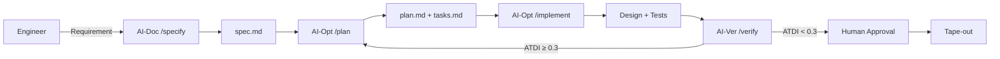

# Roadmap Técnico 2026-2029
## Silicon Synthesis Corp - Execution Capability Horizons

> **Metodología:** Gestión de Incertidumbre con Reference Class Forecasting  
> **Actualización:** Febrero 2026

---

## Visión General

```mermaid
gantt
    title Silicon Synthesis Corp - Roadmap 3 Años
    dateFormat  YYYY-Q1
    
    section Y1: Cimientos
    DARF Framework           :2026-Q1, 2026-Q2
    Neuro-Weave v1.0        :2026-Q2, 2026-Q4
    ISO 42001 Cert          :2026-Q3, 2026-Q4
    Samsung Qualification   :2026-Q3, 2027-Q1
    
    section Y2: Aceleración
    SDD Full Deploy         :2027-Q1, 2027-Q2
    Pilot Line Construction :2027-Q1, 2027-Q4
    First Customer Chips    :2027-Q3, 2027-Q4
    Neuro-Weave v2.0        :2027-Q2, 2027-Q4
    
    section Y3: Soberanía
    Production Ramp         :2028-Q1, 2028-Q3
    EU Contracts            :2028-Q1, 2028-Q4
    Neuro-Weave SaaS        :2028-Q2, 2028-Q4
```

---

## Año 1 (2026): CIMIENTOS

### Objetivo: Preparación Organizacional y Técnica

> **Meta ATDI:** < 0.2 en todos los diseños de interposer

### Q1-Q2: DARF Framework (Digital Atrophy Recovery Framework)

Prevenir deuda técnica/organizacional antes de que se acumule.

| Pilar | Acción | Entregable | Owner |
|-------|--------|------------|-------|
| **Estrategia** | Definir constitution.md | ✅ Completado | CTO |
| **Cultura** | Onboarding RACI híbrido | Manual de operaciones | HR |
| **Operaciones** | Pipeline SDD básico | /specify → /plan → /implement | CTO |
| **Tecnología** | ATDI Analyzer | Script Python | DesEng |
| **Analítica** | Dashboard métricas | Grafana/ATDI monitoring | DevOps |

### Q2-Q4: Neuro-Weave v1.0

| Milestone | Feature | Criterio de Éxito |
|-----------|---------|-------------------|
| M1 | Core CLI (init, add-component) | Unit tests passing |
| M2 | Routing engine básico | 70% valid routes |
| M3 | DRC validation | <100ms response |
| M4 | GDSII export | Compatible TSMC/Samsung |
| M5 | Audit logging | ISO 42001 compliant |

### Q3-Q4: Certificaciones y Calificación

| Hito | Probabilidad Éxito | Contingencia |
|------|-------------------|--------------|
| ISO 42001 certificación | 85% | Auditor backup |
| Samsung I-Cube calificación | 70% | Intel IFS como plan B |
| EU Chips Act aprobación | 75% | Aplicar a múltiples países |

### Riesgos Y1

| Riesgo | Prob. | Impacto | Mitigación |
|--------|-------|---------|------------|
| Retraso certificación ISO | 30% | Medio | Iniciar 6 meses antes |
| Samsung rechaza calificación | 25% | Alto | Paralelo con Intel |
| Talento insuficiente | 40% | Alto | Partnership con TU Eindhoven |

---

## Año 2 (2027): ACELERACIÓN AGÉNTICA

### Objetivo: SDD Full Deploy + Línea Piloto

> **Meta:** Reducir time-to-market 40% vs competidores

### Q1-Q2: Spec-Driven Development Completo



**Métricas de Eficiencia:**

| Métrica | Baseline (Manual) | Con SDD | Mejora |
|---------|-------------------|---------|--------|
| Tiempo diseño interposer | 12 semanas | 7 semanas | -42% |
| Iteraciones DRC | 15-20 | 3-5 | -75% |
| Documentación | 20% tiempo eng | 0% | -100% |

### Q1-Q4: Construcción Línea Piloto (Eindhoven)

| Fase | Duración | Inversión | Status |
|------|----------|-----------|--------|
| Permisos/Diseño | Q1 | €5M | Planificado |
| Construcción cleanroom | Q2-Q3 | €60M | -- |
| Instalación equipos | Q3-Q4 | €100M | -- |
| Calificación | Q4 | €15M | -- |

### Q3-Q4: Primeros Chips Cliente

| Cliente Target | Tipo | Volumen Est. | Margen |
|---------------|------|--------------|--------|
| Startup AI europea | HBM3 + GPU | 500 wafers | 35% |
| Tier-2 automotive | ADAS interposer | 1,000 wafers | 40% |
| Gov/Defense pilot | Secure compute | 200 wafers | 50% |

### Riesgos Y2

| Riesgo | Prob. | Impacto | Mitigación |
|--------|-------|---------|------------|
| Retraso construcción | 40% | Alto | Buffer 3 meses |
| Yield < 70% inicial | 50% | Medio | Ingenieros proceso TSMC |
| Cliente cancela | 25% | Medio | Pipeline 3x demanda |

---

## Año 3 (2028-2029): SOBERANÍA

### Objetivo: Producción Comercial + Moral Crumple Zones

> **Meta:** 20,000 wafers/mes capacidad

### Q1-Q2: Production Ramp

| Fase | Capacidad | Utilización | Revenue Est. |
|------|-----------|-------------|--------------|
| Ramp 1 | 5,000/mes | 40% | €228M/año |
| Ramp 2 | 10,000/mes | 60% | €600M/año |
| Ramp 3 | 20,000/mes | 80% | €2.2B/año |

### Q1-Q4: Contratos Europeos

| Segmento | Pipeline | Valor Potencial |
|----------|----------|-----------------|
| Defensa UE | 3 contratos | €150M/3 años |
| Automotive | 5 OEMs | €200M/año |
| AI/Cloud | 2 hyperscalers | €300M/año |

### Moral Crumple Zones (Protección Legal)

Sistema para proteger operadores humanos de responsabilidad en decisiones automatizadas:

```yaml
# Protocolo MCZ
decision_levels:
  L1_automated:
    - DRC checks
    - Layout optimization
    - Documentation
    liability: "AI system (insurance covered)"
    
  L2_supervised:
    - Design approval
    - Customer specs
    liability: "Shared (human oversight required)"
    
  L3_human_only:
    - Tape-out authorization
    - Contract signing
    - Safety certification
    liability: "Human accountable (full)"
```

### Q2-Q4: Neuro-Weave SaaS

| Modelo | Precio/mes | Target Customers |
|--------|------------|------------------|
| Starter | €5,000 | Startups, academia |
| Professional | €25,000 | Mid-tier design houses |
| Enterprise | Custom | Tier-1 fabless |

---

## Horizons de Capacidad de Ejecución

### Reference Class Forecasting

Basado en proyectos similares (Intel Magdeburg, TSMC Dresden):

| Milestone | Estimación Interna | Ajuste RCF | Rango Realista |
|-----------|-------------------|------------|----------------|
| Línea piloto operativa | Q1 2028 | +50% | Q1-Q3 2028 |
| Break-even | Q4 2028 | +30% | Q4 2028-Q2 2029 |
| Full capacity | Q2 2029 | +40% | Q2-Q4 2029 |

### Cone of Uncertainty

```
         Año 1          Año 2          Año 3
          ▲               ▲               ▲
         /│\             /│\             /│\
        / │ \           / │ \            │
       /  │  \         /  │  \           │
      /   │   \       /   │   \          │
     ─────┼─────     ─────┼─────      ───┼───
     ±100%            ±50%            ±25%
     
     Alta              Media           Baja
     incertidumbre     incertidumbre   incertidumbre
```

---

## Gates de Decisión (Go/No-Go)

### Gate 1: End of Y1 (Q4 2026)

| Criterio | Umbral Go | Umbral No-Go |
|----------|-----------|--------------|
| ISO 42001 cert | Obtenida | No obtenida |
| Foundry qualified | ≥1 | 0 |
| Neuro-Weave v1.0 | Released | <80% features |
| Funding secured | ≥€300M | <€200M |

### Gate 2: End of Y2 (Q4 2027)

| Criterio | Umbral Go | Umbral No-Go |
|----------|-----------|--------------|
| Pilot line status | Instalando | No iniciada |
| First customer chips | Entregados | No producidos |
| Yield | ≥60% | <50% |
| Revenue backlog | ≥€100M | <€30M |

### Gate 3: Mid Y3 (Q2 2028)

| Criterio | Umbral Go (Scale) | Umbral Pivot |
|----------|-------------------|--------------|
| Utilización | ≥50% | <30% |
| EBITDA margin | ≥25% | <15% |
| Customer satisfaction | ≥4.0/5 | <3.0/5 |

---

## Resumen de Inversión por Año

| Categoría | Y1 (€M) | Y2 (€M) | Y3 (€M) |
|-----------|---------|---------|---------|
| R&D (Neuro-Weave) | 20 | 30 | 40 |
| CAPEX (Equipos) | 50 | 150 | 50 |
| Construcción | 10 | 80 | 20 |
| Operaciones | 30 | 60 | 100 |
| **Total** | **110** | **320** | **210** |

---

*Roadmap sujeto a actualización trimestral*
*Silicon Synthesis Corp*
