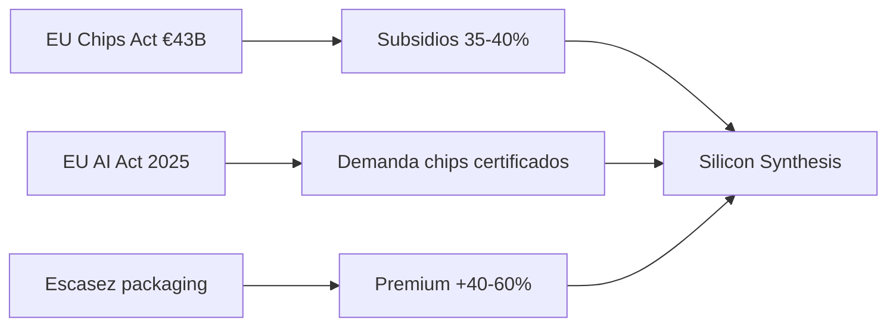

# Silicon Synthesis Corp
## Investor Pitch Deck

---

# Slide 1: Título

```
╔══════════════════════════════════════════════════════════════╗
║                                                              ║
║            ████  SILICON SYNTHESIS CORP  ████                ║
║                                                              ║
║       "Hardware Definido por Software + Gobernanza"          ║
║                                                              ║
║                     Series A - €120M                         ║
║                                                              ║
║                     Febrero 2026                             ║
║                                                              ║
╚══════════════════════════════════════════════════════════════╝
```

---

# Slide 2: El Problema

## La IA tiene hambre de silicio

| Demanda | Capacidad | Déficit |
|---------|-----------|---------|
| >200K wafers/mes | 150K wafers/mes | **50K wafers/mes** |

### Cuellos de Botella Críticos

1. **CoWoS Packaging** - TSMC al 100% capacidad
2. **Memoria HBM** - 18 meses de espera
3. **Personal cualificado** - 10,000+ vacantes en UE

> **"Los chips están diseñados, pero no pueden fabricarse"**

---

# Slide 3: La Solución

## No fabricamos transistores. Empaquetamos inteligencia.

```
┌─────────────────────────────────────────────────────┐
│                                                     │
│   GPU Die  ←──┬──→  HBM Stack                      │
│               │                                     │
│          ┌────┴────┐                               │
│          │INTERPOSER│  ← Nosotros diseñamos esto   │
│          └────┬────┘                               │
│               │                                     │
│          Substrate                                  │
│                                                     │
└─────────────────────────────────────────────────────┘
```

### Nuestra Propuesta

| Capa | Valor |
|------|-------|
| **Hardware** | Interposers 2.5D/3D + HBM stacking |
| **Software** | Neuro-Weave (EDA propietario) |
| **Gobernanza** | ISO 42001 + EU AI Act compliance |

---

# Slide 4: Por Qué Ahora

## Ventana de Oportunidad 2026-2030



### Timing Perfecto

- **Regulación:** EU AI Act activo → demanda de trazabilidad
- **Subsidios:** EU Chips Act cierra ventana 2027
- **Mercado:** Hyperscalers con backlog hasta 2028

---

# Slide 5: Diferenciación

## No vendemos chips. Vendemos CONFIANZA.

| Atributo | Competidor Típico | Silicon Synthesis |
|----------|-------------------|-------------------|
| Trazabilidad | ❌ Manual | ✅ Automática |
| EU AI Act | ⚠️ Parcial | ✅ Nativo |
| Audit trail | ❌ No existe | ✅ Cada decisión |
| Certificación | Meses | Continua |

### El "Pasaporte Digital" del Chip

```json
{
  "chip_id": "SSC-2026-HBM4-001",
  "constitution_version": "1.2",
  "atdi_score": 0.18,
  "audit_log": "256 decisions logged",
  "human_approvals": 12,
  "compliance": ["ISO42001", "EUAIA", "GDPR"]
}
```

---

# Slide 6: Producto

## Neuro-Weave: EDA Impulsado por IA

### Flujo de Trabajo

```
Ingeniero  →  AI-Doc  →  spec.md  →  AI-Opt  →  Diseño  →  Humano  →  Fab
   (req)      (/specify)            (/plan)    (layout)  (approve)
```

### Benchmarks

| Métrica | Manual | Con Neuro-Weave | Mejora |
|---------|--------|-----------------|--------|
| Tiempo diseño | 12 sem | 7 sem | **-42%** |
| Iteraciones DRC | 15-20 | 3-5 | **-75%** |
| Costo documentación | 20% tiempo | 0% | **-100%** |

---

# Slide 7: Modelo de Negocio

## Tres Streams de Revenue

```
      ┌─────────────────────────────────────────┐
      │                                         │
      │  60%  Packaging Services (Diseño+Fab)   │████████████
      │                                         │
      │  25%  Neuro-Weave SaaS (Licencias)      │██████
      │                                         │
      │  15%  AI Trust Certification            │███
      │                                         │
      └─────────────────────────────────────────┘
```

### Unit Economics

| Métrica | Valor |
|---------|-------|
| ASP por wafer | €10,000 |
| COGS | €6,200 |
| Gross margin | **38-46%** |
| Premium compliance | +15-25% |

---

# Slide 8: Mercado

## TAM/SAM/SOM

```
        ┌───────────────────────────────────────┐
        │                                       │
        │    TAM: €85B (Advanced Packaging)     │
        │    ┌───────────────────────────────┐  │
        │    │                               │  │
        │    │  SAM: €25B (AI/HPC segment)   │  │
        │    │  ┌───────────────────────┐    │  │
        │    │  │                       │    │  │
        │    │  │  SOM: €2.2B (5% Y5)   │    │  │
        │    │  │                       │    │  │
        │    │  └───────────────────────┘    │  │
        │    │                               │  │
        │    └───────────────────────────────┘  │
        │                                       │
        └───────────────────────────────────────┘
```

### Segmentos Objetivo

| Segmento | TAM | Ventaja SSC |
|----------|-----|-------------|
| Defensa/Gov | €45B | Audit compliance |
| Finanzas | €30B | Regulación |
| Automotive | €25B | Safety cert |

---

# Slide 9: Tracción

## Hitos Completados (Pre-Revenue)

| Hito | Status | Fecha |
|------|--------|-------|
| Constitution.md | ✅ | Feb 2026 |
| ATDI Framework | ✅ | Feb 2026 |
| Neuro-Weave spec | ✅ | Feb 2026 |
| EU Chips Act application | 🔄 En proceso | Mar 2026 |
| Samsung qualification | 🔄 Iniciando | Q2 2026 |

## Pipeline Clientes (LOI)

| Cliente | Tipo | Valor Potencial |
|---------|------|-----------------|
| EU Defense contractor | Gov | €50M/año |
| Tier-2 Automotive | Auto | €30M/año |
| AI Startup (EU) | HPC | €10M/año |

---

# Slide 10: Equipo

## Matriz Humano/IA (RACI)

```
┌────────────────────────────────────────────────────┐
│  ACCOUNTABLE (Responsabilidad Final): SOLO HUMANOS │
│                                                    │
│  • CEO: Estrategia, inversores                     │
│  • CTO: Arquitectura, calificación foundry         │
│  • Ethics Officer: ISO 42001, EU AI Act            │
├────────────────────────────────────────────────────┤
│  RESPONSIBLE (Ejecución): HUMANOS + IA             │
│                                                    │
│  • AI-Doc: Specs, documentación                    │
│  • AI-Opt: Layouts, optimización                   │
│  • AI-Ver: DRC, verificación                       │
└────────────────────────────────────────────────────┘
```

### Ventaja: Escalabilidad sin Deuda

- IA acelera 82% de tareas operativas
- Humanos controlan 100% de decisiones críticas
- Cero "IA alucinada" en tape-out

---

# Slide 11: Financials

## Proyección 5 Años

| Año | Revenue | EBITDA | Margen |
|-----|---------|--------|--------|
| Y1 | €228M | €47M | 21% |
| Y2 | €528M | €156M | 30% |
| Y3 | €1.06B | €375M | 35% |
| Y4 | €1.58B | €621M | 39% |
| Y5 | €2.21B | €937M | **42%** |

### Métricas de Inversión

| Indicador | Valor |
|-----------|-------|
| IRR | **35%** |
| NPV | **€580M** |
| Payback | **3.2 años** |
| Revenue/Employee Y5 | €7.4M |

---

# Slide 12: The Ask

## Series A: €120M

### Uso de Fondos

| Categoría | € | % |
|-----------|---|---|
| Equipos packaging | 180M | 45% |
| Cleanroom | 80M | 20% |
| R&D Neuro-Weave | 50M | 12% |
| Certificaciones | 15M | 4% |
| Runway 18m | 75M | 19% |

### Cap Table Post-Round

| Source | € | % |
|--------|---|---|
| EU Chips Act | 140M | 35% |
| BEI Loan | 100M | 25% |
| **Series A** | **120M** | **30%** |
| Bank debt | 40M | 10% |

---

# Slide 13: Exit Scenarios

## Valuation Multiples

| Escenario | Prob | Valuation Y5 | Multiple |
|-----------|------|--------------|----------|
| Optimista | 20% | €3.5B | 29x |
| Base | 60% | €2.5B | 21x |
| Pesimista | 20% | €1.0B | 8x |

### Comparables

| Company | EV/Revenue | Notes |
|---------|------------|-------|
| ASML | 8x | Monopolio EUV |
| Synopsis | 12x | EDA puro |
| Cadence | 11x | EDA puro |
| **SSC (est.)** | **8-12x** | EDA + Fab |

---

# Slide 14: Why Us?

## Factores Críticos de Éxito

| Factor | Nuestra Ventaja |
|--------|-----------------|
| Timing | Ventana EU Chips Act 2026-2027 |
| Ubicación | Eindhoven (ASML ecosystem) |
| Moat | Gobernanza no replicable |
| Equipo | RACI Humano/IA definido |
| Tecnología | Neuro-Weave patentable |

### El Moat de la Confianza

> **"Cualquiera puede fabricar un chip. Solo nosotros certificamos que es CONFIABLE."**

---

# Slide 15: Call to Action

## Próximos Pasos

1. **Q1 2026:** Cierre Series A
2. **Q2 2026:** Aprobación EU Chips Act
3. **Q4 2026:** ISO 42001 certificación
4. **Q1 2028:** Línea piloto operativa

### Contacto

```
Silicon Synthesis Corp
Eindhoven, Netherlands (HQ en formación)

📧 investors@siliconsynthesis.eu
🔗 www.siliconsynthesis.eu/series-a
```

---

*Confidencial - Solo para inversores cualificados*
