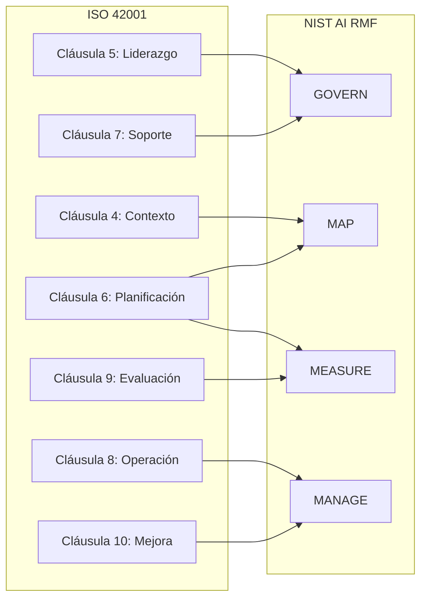

# Mapeo Cruzado ISO 42001 ↔ NIST AI RMF

> Este documento establece la correspondencia entre los controles de ISO/IEC 42001:2023 y las funciones del NIST AI Risk Management Framework para evitar duplicidad de esfuerzos y garantizar cumplimiento dual.

---

## Visión General



---

## Tabla de Mapeo Detallado

| ISO 42001 Cláusula | Requisito ISO | NIST AI RMF Función | Subcategoría NIST | Acción Unificada |
|--------------------|---------------|---------------------|-------------------|------------------|
| 4.1 | Comprensión del contexto | **MAP** | MAP 1.1, 1.2 | Identificar stakeholders y contexto de uso del chip |
| 4.2 | Partes interesadas | **MAP** | MAP 1.5 | Documentar necesidades de foundries, fabless, reguladores |
| 5.1 | Liderazgo y compromiso | **GOVERN** | GOVERN 1.1 | CEO define política de IA responsable |
| 5.2 | Política de IA | **GOVERN** | GOVERN 1.2 | Publicar política alineada con constitution.md |
| 5.3 | Roles y responsabilidades | **GOVERN** | GOVERN 2.1 | Implementar matriz RACI |
| 6.1 | Riesgos y oportunidades | **MAP** | MAP 2.1, 2.2 | Análisis de riesgos pre-proyecto |
| 6.2 | Objetivos de IA | **MAP** | MAP 3.1 | Definir KPIs de diseño |
| 7.1 | Recursos | **GOVERN** | GOVERN 3.1 | Asignar presupuesto y personal |
| 7.2 | Competencia | **GOVERN** | GOVERN 4.1 | Programa de formación en IA |
| 7.3 | Concienciación | **GOVERN** | GOVERN 4.2 | Comunicación de políticas |
| 7.5 | Información documentada | **GOVERN** | GOVERN 5.1 | Sistema de gestión documental |
| 8.1 | Planificación operacional | **MANAGE** | MANAGE 1.1 | Controles operacionales |
| 8.2 | Evaluación de impacto | **MEASURE** | MEASURE 1.1 | Evaluación de impacto de IA |
| 8.3 | Tratamiento de riesgos | **MANAGE** | MANAGE 2.1. | Mitigación de riesgos |
| 8.4 | Proveedores externos | **MANAGE** | MANAGE 3.1 | Auditoría de cadena de suministro |
| 9.1 | Monitoreo y medición | **MEASURE** | MEASURE 2.1 | Métricas de desempeño |
| 9.2 | Auditoría interna | **MEASURE** | MEASURE 3.1 | Auditorías trimestrales |
| 9.3 | Revisión por dirección | **GOVERN** | GOVERN 6.1 | Revisión ejecutiva |
| 10.1 | Mejora continua | **MANAGE** | MANAGE 4.1 | Ciclo PDCA |
| 10.2 | No conformidades | **MANAGE** | MANAGE 4.2 | Acciones correctivas |

---

## Implementación Práctica

### Para Cumplir Ambos Marcos Simultáneamente:

1. **Un Solo Análisis de Riesgos**
   - Usar NIST MAP para identificar riesgos
   - Documentar en formato compatible con ISO 42001 Cláusula 6.1

2. **Un Solo Sistema de Métricas**
   - NIST MEASURE proporciona las categorías
   - ISO 42001 Cláusula 9.1 requiere el monitoreo
   - Implementar dashboard unificado

3. **Una Sola Política de Gobernanza**
   - `constitution.md` satisface tanto NIST GOVERN como ISO 42001 Cláusula 5

4. **Un Solo Proceso de Mejora**
   - Retrospectivas post-proyecto alimentan tanto NIST MANAGE como ISO 42001 Cláusula 10

---

## Checklist de Auditoría Unificada

```markdown
## Pre-Proyecto
- [ ] Contexto documentado (ISO 4.1 / NIST MAP 1.1)
- [ ] Stakeholders identificados (ISO 4.2 / NIST MAP 1.5)
- [ ] Riesgos evaluados (ISO 6.1 / NIST MAP 2.1)
- [ ] Política aplicada (ISO 5.2 / NIST GOVERN 1.2)

## Durante Proyecto
- [ ] RACI activo (ISO 5.3 / NIST GOVERN 2.1)
- [ ] Métricas monitoreadas (ISO 9.1 / NIST MEASURE 2.1)
- [ ] Controles operacionales funcionando (ISO 8.1 / NIST MANAGE 1.1)

## Post-Proyecto
- [ ] Auditoría completada (ISO 9.2 / NIST MEASURE 3.1)
- [ ] Lecciones aprendidas documentadas (ISO 10.1 / NIST MANAGE 4.1)
- [ ] No conformidades resueltas (ISO 10.2 / NIST MANAGE 4.2)
```

---

*Última actualización: 2026-02-09*
