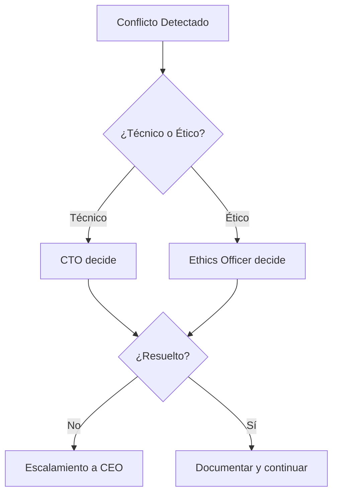

# Matriz RACI Híbrida - Silicon Synthesis Corp

> **R** = Responsible (Ejecuta la tarea)  
> **A** = Accountable (Responsable final, solo 1 por tarea)  
> **C** = Consulted (Provee input)  
> **I** = Informed (Recibe información)

---

## Roles Definidos

| Código | Rol | Tipo | Descripción |
|--------|-----|------|-------------|
| CEO | Chief Executive Officer | Humano | Máxima autoridad ejecutiva |
| CTO | Chief Technology Officer | Humano | Dirección técnica |
| CPO | Chief Product Officer | Humano | Estrategia de producto |
| EthO | Ethics Officer | Humano | Cumplimiento ético y regulatorio |
| DesEng | Design Engineer | Humano | Ingeniero de diseño de chips |
| AI-Opt | Agente Optimizador | IA | Optimización de layouts |
| AI-Ver | Agente Verificador | IA | DRC/LVS automatizado |
| AI-Doc | Agente Documentador | IA | Generación de documentación |

---

## Matriz RACI por Actividad

### Fase 1: Definición de Requisitos

| Actividad | CEO | CTO | CPO | EthO | DesEng | AI-Opt | AI-Ver | AI-Doc |
|-----------|-----|-----|-----|------|--------|--------|--------|--------|
| Captura de requisitos del cliente | I | C | **A** | C | R | - | - | I |
| Definición de especificaciones técnicas | I | **A** | C | C | R | - | - | R |
| Análisis de viabilidad | I | **A** | C | C | R | C | - | R |
| Evaluación de riesgos éticos | C | C | C | **A** | C | - | - | R |

### Fase 2: Diseño

| Actividad | CEO | CTO | CPO | EthO | DesEng | AI-Opt | AI-Ver | AI-Doc |
|-----------|-----|-----|-----|------|--------|--------|--------|--------|
| Diseño inicial del interposer | I | C | I | I | **A** | R | - | I |
| Optimización de layout | I | C | I | I | **A** | R | C | I |
| Verificación DRC (Design Rule Check) | I | I | I | I | **A** | - | R | I |
| Verificación LVS (Layout vs Schematic) | I | I | I | I | **A** | - | R | I |
| Revisión de cumplimiento regulatorio | I | C | C | **A** | C | - | - | R |

### Fase 3: Tape-out

| Actividad | CEO | CTO | CPO | EthO | DesEng | AI-Opt | AI-Ver | AI-Doc |
|-----------|-----|-----|-----|------|--------|--------|--------|--------|
| Decisión de tape-out | C | **A** | C | C | R | - | - | I |
| Generación de GDSII final | I | C | I | I | **A** | - | R | R |
| Documentación de trazabilidad | I | C | I | **A** | C | - | - | R |

### Fase 4: Post-Producción

| Actividad | CEO | CTO | CPO | EthO | DesEng | AI-Opt | AI-Ver | AI-Doc |
|-----------|-----|-----|-----|------|--------|--------|--------|--------|
| Análisis de defectos | I | **A** | I | C | R | C | R | R |
| Retrospectiva del proyecto | C | **A** | C | C | R | I | I | R |
| Actualización de métricas ATDI | I | **A** | I | C | R | R | R | R |

---

## Reglas de Gobernanza

> [!IMPORTANT]
> 1. **Solo humanos pueden ser Accountable (A)**. Los agentes de IA nunca tienen responsabilidad final.
> 2. **Tape-out requiere aprobación explícita** del CTO. Ningún agente puede autorizar envío a fab.
> 3. **El Ethics Officer tiene poder de veto** en cualquier fase si detecta riesgos éticos.

---

## Escalamiento de Conflictos

---

*Última actualización: 2026-02-09*
