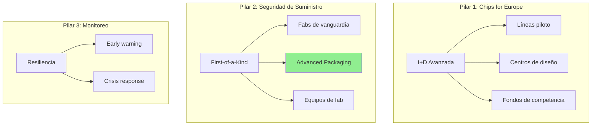

# EU Chips Act - Análisis de Elegibilidad y Subsidios

> **Objetivo:** Evaluar cómo Silicon Synthesis Corp puede capitalizar los incentivos del European Chips Act para establecer operaciones en Europa.

---

## 1. Resumen del EU Chips Act

**European Chips Act (2023)** - Regulación (UE) 2023/1781

| Aspecto | Detalle |
|---------|---------|
| Presupuesto | €43 mil millones (público + privado) |
| Objetivo | Duplicar cuota de mercado UE al 20% para 2030 |
| Horizonte | 2023-2030 |
| Tipo | Subsidios directos + garantías + I+D |

---

## 2. Pilares del EU Chips Act



> **Pilar 2 - Advanced Packaging es nuestra oportunidad directa**

---

## 3. Criterios de Elegibilidad

### 3.1 "First-of-a-Kind" (FOAK) Facilities

Para calificar como instalación FOAK, Silicon Synthesis debe demostrar:

| Criterio | Requisito | Cumplimiento SSC |
|----------|-----------|------------------|
| Innovación | Tecnología no disponible en UE | ✅ CoWoS/HBM assembly |
| Inversión | Significativa (>€500M típico) | ⚠️ Requiere partners |
| Creación empleo | >500 empleos directos | ⏳ Planificado |
| Spillover | Beneficio cadena de valor UE | ✅ Proveedores locales |
| Compromiso | Priorizar suministro UE en crisis | ✅ Aceptable |

### 3.2 Open EU Foundry (OEF) Status

| Requisito | Descripción | Cumplimiento SSC |
|-----------|-------------|------------------|
| Acceso abierto | Ofrecer capacidad a terceros | ✅ Modelo de negocio |
| Neutralidad | No discriminar clientes | ✅ Policy |
| Transparencia | Publicar precios indicativos | ⚠️ Negociable |

---

## 4. Incentivos Disponibles

### 4.1 Subsidios Directos por País

| País | Programa | Fondo | Estado |
|------|----------|-------|--------|
| 🇩🇪 Alemania | IPCEI Microelectronics II | €10B+ | Activo |
| 🇫🇷 Francia | France 2030 Semiconductors | €5.5B | Activo |
| 🇳🇱 Países Bajos | Brainport Industries | €2B | Activo |
| 🇮🇪 Irlanda | IDA Ireland Grants | €1B+ | Activo |
| 🇪🇸 España | PERTE Chip | €12.3B | En desarrollo |

### 4.2 Estructura Típica de Financiación

```
┌─────────────────────────────────────────────┐
│  Proyecto €1B (Ejemplo)                     │
├─────────────────────────────────────────────┤
│  30-40% Subsidio directo UE/Estado (~€350M) │
│  20-30% Préstamos blandos BEI     (~€250M)  │
│  30-40% Capital privado           (~€400M)  │
└─────────────────────────────────────────────┘
```

---

## 5. Ventaja Competitiva de SSC

### 5.1 Alineación con Objetivos UE

| Objetivo UE | Cómo SSC Contribuye |
|-------------|---------------------|
| Soberanía tecnológica | Reduce dependencia de Asia |
| Resiliencia | Capacidad packaging en suelo europeo |
| Innovación | Herramientas EDA propias (Neuro-Weave) |
| Regulación AI | Cumplimiento nativo EU AI Act |

### 5.2 Nuestra Propuesta de Valor para Reguladores

> **"Silicon Synthesis Corp ofrece no solo capacidad de fabricación, sino CHIPS CERTIFICADOS para IA Trustworthy, con audit trail completo compatible con EU AI Act y GDPR desde el diseño."**

### 5.3 Diferenciación vs Competidores

| Aspecto | Intel (Magdeburg) | TSMC (Dresden) | SSC (Propuesta) |
|---------|-------------------|----------------|-----------------|
| Foco | Lógica avanzada | Lógica madura | **Advanced Packaging** |
| Competencia directa | Nvidia/AMD | Automotriz | Complementario |
| Certificación AI | No | No | **ISO 42001/NIST** |
| Escala inicial | Mega-fab | Mega-fab | **Lean startup** |

---

## 6. Ubicaciones Estratégicas

### 6.1 Análisis Comparativo

| Ubicación | Ventajas | Desventajas | Score |
|-----------|----------|-------------|-------|
| 🇳🇱 **Eindhoven** | Proximidad ASML, ecosistema | Costo laboral alto | 9/10 |
| 🇩🇪 **Dresden** | "Silicon Saxony", subsidios | Competencia TSMC/Intel | 8/10 |
| 🇮🇪 **Dublin** | Impuestos, English-speaking | Sin ecosistema fab | 6/10 |
| 🇪🇸 **Barcelona** | PERTE Chip, talento | Infraestructura inmadura | 7/10 |

### 6.2 Recomendación: Países Bajos (Eindhoven)

**Justificación:**
- **ASML** headquarters (acceso directo a maquinaria)
- **IMEC** nearby (I+D colaborativa)
- **NXP, Philips** (ecosistema de talento)
- **Brainport** incentives activos
- Infraestructura logística (Rotterdam, Schiphol)

---

## 7. Roadmap de Aplicación

### Fase 1: Pre-Aplicación (T1-T2 2026)

| Acción | Responsable | Deadline |
|--------|-------------|----------|
| Registrar entidad legal en NL | Legal | Marzo 2026 |
| Contactar Brainport Development | CEO | Febrero 2026 |
| Preparar business plan detallado | CPO | Abril 2026 |
| Identificar socios inversores | CEO | Mayo 2026 |

### Fase 2: Aplicación IPCEI (T3 2026)

| Acción | Responsable | Deadline |
|--------|-------------|----------|
| Submit Expression of Interest | CEO | Julio 2026 |
| Due diligence con autoridades | Legal/CFO | Agosto 2026 |
| Negociación términos | CEO | Sept 2026 |

### Fase 3: Inicio Operaciones (2027)

| Milestone | Target |
|-----------|--------|
| Aprobación subsidio | Q1 2027 |
| Construcción instalación | Q2-Q4 2027 |
| Línea piloto operativa | Q1 2028 |
| Producción comercial | Q3 2028 |

---

## 8. Estimación de Subsidios

### Escenario Conservador (Instalación Piloto)

| Concepto | Inversión | Subsidio Est. (35%) |
|----------|-----------|---------------------|
| Equipos packaging | €200M | €70M |
| Instalaciones | €80M | €28M |
| I+D (3 años) | €50M | €25M |
| Capital trabajo | €70M | - |
| **Total** | **€400M** | **~€123M** |

### Escenario Ambicioso (Full-Scale)

| Concepto | Inversión | Subsidio Est. (40%) |
|----------|-----------|---------------------|
| Equipos packaging | €600M | €240M |
| Instalaciones | €200M | €80M |
| I+D (5 años) | €150M | €75M |
| Capital trabajo | €150M | - |
| **Total** | **€1.1B** | **~€395M** |

---

## 9. Requisitos de Cumplimiento Post-Subsidio

| Obligación | Período | Penalización |
|------------|---------|--------------|
| Mantener operaciones en UE | 10 años | Devolución proporcional |
| Reportes de progreso | Trimestral | Suspensión pagos |
| Prioridad suministro UE en crisis | Permanente | Sanciones |
| Auditorías | Anual | Acceso inspectores |

---

*Análisis preparado para Silicon Synthesis Corp*
*Confidencial - No distribuir*
