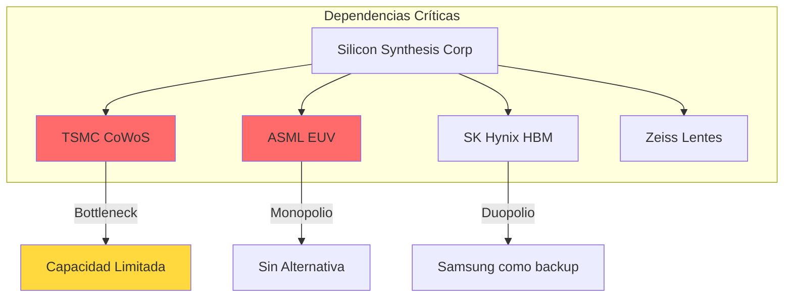
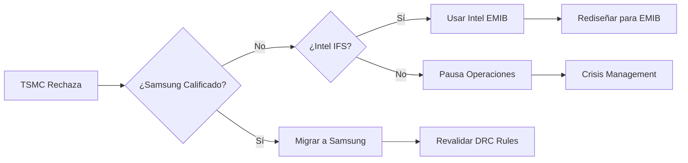

# Supply Chain Risk Analysis
## NIST AI RMF - MAP Function Applied to CoWoS Dependency

> **Clasificación:** Estratégico  
> **Fecha:** 2026-02-09  
> **Función NIST:** MAP (Contextualizar Riesgos)

---

## 1. Resumen Ejecutivo

**Silicon Synthesis Corp** depende críticamente de terceros para fabricación de interposers CoWoS. Este documento aplica la función **MAP** del NIST AI RMF para identificar, clasificar y proponer mitigaciones a los riesgos de cadena de suministro.



---

## 2. Matriz de Riesgos de Proveedores

### 2.1 Clasificación NIST MAP

| Proveedor | Componente | Concentración | Impacto si Falla | Alternativas | Risk Score |
|-----------|------------|---------------|------------------|--------------|------------|
| **TSMC** | CoWoS Interposer | Monopolio (>90%) | 🔴 Crítico | Samsung, Intel | 9.5/10 |
| **ASML** | Litografía EUV | Monopolio (100%) | 🔴 Crítico | Ninguna | 10/10 |
| **SK Hynix** | HBM3/HBM3e | Duopolio (50%) | 🟠 Alto | Samsung, Micron | 7/10 |
| **Zeiss** | Lentes EUV | Monopolio (100%) | 🔴 Crítico | Ninguna | 10/10 |
| **Ibiden** | Substrates | Oligopolio | 🟡 Medio | Shinko, AT&S | 5/10 |

### 2.2 Análisis del Cuello de Botella CoWoS

**Situación Actual (2026):**

| Métrica | Valor | Fuente |
|---------|-------|--------|
| Capacidad CoWoS TSMC | ~150,000 wafers/mes | Estimación industria |
| Demanda AI (Nvidia, AMD) | >200,000 wafers/mes | Backlog reportado |
| Déficit | ~50,000 wafers/mes | Cálculo |
| Tiempo de espera | 12-18 meses | Lead time actual |
| Costo CoWoS vs tradicional | +40-60% | Premium de escasez |

**Implicación para Silicon Synthesis:**
- Como nuevo entrante, **no tenemos prioridad** en la cola de TSMC
- Los "hyperscalers" (Nvidia, Google, Meta) tienen contratos reservados hasta 2027-2028
- Debemos ofrecer **diferenciación** que justifique asignación de capacidad

---

## 3. Análisis de Riesgos Detallado

### 3.1 Riesgo R-001: Dependencia TSMC

```yaml
risk_id: R-001
category: SUPPLY_CHAIN
severity: CRITICAL
probability: HIGH
impact: CATASTROPHIC

description: |
  TSMC controla >90% de la capacidad global de CoWoS.
  Si TSMC rechaza contratos o prioriza competidores,
  Silicon Synthesis no puede fabricar producto.

triggers:
  - Conflicto geopolítico Taiwan-China
  - Priorización de clientes premium (Nvidia/Apple)
  - Desastre natural (terremoto, sequía)
  - Restricciones de exportación

current_controls: NONE

recommended_mitigations:
  - M-001: Diseñar interposers multi-foundry compatibles
  - M-002: Iniciar calificación con Samsung Foundry
  - M-003: Explorar Intel Foundry Services (IFS)
  - M-004: Desarrollar packaging "chiplet-agnostic"
```

### 3.2 Riesgo R-002: Monopolio ASML

```yaml
risk_id: R-002
category: TECHNOLOGY
severity: CRITICAL
probability: MEDIUM
impact: EXISTENTIAL

description: |
  ASML es el único fabricante de máquinas EUV.
  Si ASML no puede entregar o si hay restricciones
  de exportación, toda la industria se paraliza.

note: |
  Este riesgo afecta a TODA la industria, no solo a nosotros.
  Es sistémico y no mitigable individualmente.

current_controls: NONE
recommended_mitigations:
  - M-005: Diseñar con nodos DUV donde sea posible (≥14nm)
  - M-006: Monitorear alternativas chinas (SMIC DUV multi-patterning)
```

### 3.3 Riesgo R-003: Escasez HBM

```yaml
risk_id: R-003
category: SUPPLY_CHAIN
severity: HIGH
probability: HIGH
impact: SEVERE

description: |
  SK Hynix y Samsung controlan >95% del mercado HBM.
  La demanda de AI supera la capacidad de producción.
  Los precios han subido 50-100% en 12 meses.

current_controls:
  - Diseño multi-proveedor (spec compatible con HBM2e/HBM3/HBM3e)

recommended_mitigations:
  - M-007: Contratos de suministro a largo plazo (LTA)
  - M-008: Calificar Micron como tercer proveedor
  - M-009: Diseñar para GDDR como fallback (menor rendimiento)
```

---

## 4. Mapa de Contingencias

### 4.1 Escenario: TSMC No Disponible



### 4.2 Compatibilidad Multi-Foundry

| Feature | TSMC CoWoS | Samsung I-Cube | Intel EMIB |
|---------|------------|----------------|------------|
| TSV Pitch | 40μm | 45μm | 55μm |
| Micro-bump | 40μm | 40μm | 45μm |
| Max Area | 2500mm² | 2000mm² | 1800mm² |
| HBM Support | HBM3e | HBM3 | HBM3 |

> [!IMPORTANT]
> **Recomendación:** Diseñar con especificaciones **más conservadoras** (45μm pitch) para garantizar portabilidad entre foundries.

---

## 5. Ventaja Competitiva: Gobernanza como Diferenciador

### 5.1 Por Qué Nuestra Certificación Importa

Mientras competidores asiáticos ofrecen menor costo, **Silicon Synthesis ofrece:**

| Atributo | Competidores Asiáticos | Silicon Synthesis |
|----------|------------------------|-------------------|
| Precio | ✅ Menor | ⚠️ Premium |
| Cumplimiento EU AI Act | ❌ No garantizado | ✅ Nativo |
| Audit Trail ISO 42001 | ❌ No disponible | ✅ Automatizado |
| Trazabilidad GDPR | ⚠️ Parcial | ✅ Completa |
| Contratos gubernamentales | ⚠️ Restricciones | ✅ Elegible |

### 5.2 Mercados Objetivo (Alta Tolerancia a Premium)

| Segmento | Valor 2026 | Requisito Clave | Ventaja SSC |
|----------|------------|-----------------|-------------|
| Defensa/Aerospace | $45B | ITAR/cumplimiento | Audit trail |
| Sector Financiero | $30B | Regulación estricta | ISO 42001 |
| Automotriz ADAS | $25B | Safety certification | Trazabilidad |
| Salud/Medical AI | $15B | FDA compliance | Gobernanza |

---

## 6. Plan de Mitigación Consolidado

### Prioridad P0 (Inmediato)

| ID | Acción | Owner | Deadline |
|----|--------|-------|----------|
| M-001 | Diseñar interposers con specs multi-foundry (45μm pitch) | CTO | T2 2026 |
| M-007 | Negociar LTA con SK Hynix para HBM3 | CPO | T1 2026 |

### Prioridad P1 (6 meses)

| ID | Acción | Owner | Deadline |
|----|--------|-------|----------|
| M-002 | Iniciar calificación Samsung I-Cube | DesEng | T3 2026 |
| M-003 | Explorar Intel Foundry Services | CEO | T2 2026 |

### Prioridad P2 (12 meses)

| ID | Acción | Owner | Deadline |
|----|--------|-------|----------|
| M-008 | Calificar Micron como proveedor HBM | DesEng | T4 2026 |
| M-006 | Monitorear avances DUV multi-patterning | CTO | Continuo |

---

## 7. KPIs de Monitoreo

| Indicador | Umbral Verde | Umbral Amarillo | Umbral Rojo |
|-----------|--------------|-----------------|-------------|
| Lead time TSMC | < 6 meses | 6-12 meses | > 12 meses |
| Precio HBM/GB | < $10 | $10-15 | > $15 |
| Foundries calificadas | ≥ 2 | 1 | 0 |
| Contratos LTA activos | ≥ 2 | 1 | 0 |

---

*Documento generado bajo NIST AI RMF - Función MAP*
*Silicon Synthesis Corp - Confidencial*
