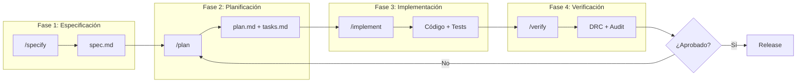

# Pipeline Agéntico SDD - Silicon Synthesis Corp

> **Spec-Driven Development (SDD)** aplicado al diseño de semiconductores.

---

## Visión General



---

## Comandos del Pipeline

### `/specify` - Captura de Requisitos

**Input:** Descripción de alto nivel del ingeniero  
**Output:** `spec.md` estructurado

```bash
# Ejemplo de uso
silicon-agent specify "Diseñar interposer para GPU H100 + 6x HBM3"
```

**Agente Responsable:** AI-Doc (R)  
**Humano Accountable:** CPO (A)

---

### `/plan` - Arquitectura Técnica

**Input:** `spec.md` aprobado  
**Output:** `plan.md` (arquitectura) + `tasks.md` (desglose)

```bash
silicon-agent plan --spec ./specs/neuro_weave/spec.md
```

**Contenido de plan.md:**
- Stack tecnológico seleccionado
- Diagrama de componentes
- Interfaces entre módulos
- Estimación de esfuerzo

**Agente Responsable:** AI-Opt (R)  
**Humano Accountable:** CTO (A)

---

### `/implement` - Generación de Código

**Input:** `plan.md` + `tasks.md`  
**Output:** Código fuente + tests unitarios

```bash
silicon-agent implement --task "Crear módulo de routing TSV"
```

**Reglas de Implementación:**
1. Código debe pasar linters (Rust: clippy, Python: ruff)
2. Cobertura de tests ≥ 80%
3. Documentación inline obligatoria
4. Referencia a spec.md en cada función pública

**Agente Responsable:** AI-Opt (R)  
**Humano Accountable:** DesEng (A)

---

### `/verify` - Validación

**Input:** Código implementado  
**Output:** Reportes de verificación

```bash
silicon-agent verify --project neuro_weave
```

**Verificaciones Ejecutadas:**

| Verificación | Herramienta | Umbral |
|--------------|-------------|--------|
| Unit Tests | pytest/cargo test | 100% pass |
| Coverage | coverage.py/tarpaulin | ≥ 80% |
| Linting | ruff/clippy | 0 errors |
| ATDI Score | custom | < 0.3 |
| Security | bandit/cargo-audit | 0 critical |
| DRC (diseños) | neuro-weave drc | 100% pass |

**Agente Responsable:** AI-Ver (R)  
**Humano Accountable:** DesEng (A)

---

## Roles de Agentes IA

| Agente | Código | Función | Permisos |
|--------|--------|---------|----------|
| Documentador | AI-Doc | Genera specs, documenta APIs | Solo lectura de código |
| Optimizador | AI-Opt | Genera código, optimiza layouts | Escritura supervisada |
| Verificador | AI-Ver | Ejecuta tests, valida DRC | Solo lectura |

---

## Constitution Guard

Antes de cada output, los agentes verifican contra `constitution.md`:

```python
# Pseudocódigo del guard
def constitution_check(output: DesignOutput) -> bool:
    rules = load_constitution("governance/constitution.md")
    
    for rule in rules.physical_constraints:
        if not output.satisfies(rule):
            log_violation(rule, output)
            return False
    
    for rule in rules.governance_constraints:
        if not output.complies(rule):
            log_violation(rule, output)
            return False
    
    return True
```

---

## Audit Trail

Cada ejecución de comando genera un registro:

```json
{
  "timestamp": "2026-02-09T12:20:00Z",
  "command": "/implement",
  "agent": "AI-Opt",
  "task_ref": "TASK-042",
  "input_hash": "sha256:a1b2c3...",
  "output_hash": "sha256:d4e5f6...",
  "constitution_check": "PASS",
  "human_approval": null,
  "status": "PENDING_REVIEW"
}
```

---

## Workflow Completo (Ejemplo)

```mermaid
sequenceDiagram
    participant Eng as Design Engineer
    participant Doc as AI-Doc
    participant Opt as AI-Opt
    participant Ver as AI-Ver
    participant CTO
    
    Eng->>Doc: /specify "Nuevo interposer HBM4"
    Doc-->>Eng: spec.md generado
    Eng->>CTO: Revisión de spec
    CTO-->>Eng: Aprobado ✓
    
    Eng->>Opt: /plan --spec spec.md
    Opt-->>Eng: plan.md + tasks.md
    CTO-->>Eng: Aprobado ✓
    
    loop Por cada task
        Eng->>Opt: /implement --task TASK-N
        Opt-->>Eng: Código generado
        Eng->>Ver: /verify --module módulo_N
        Ver-->>Eng: Report de verificación
    end
    
    Eng->>CTO: Solicitud de release
    CTO-->>Eng: Aprobado ✓
    Eng->>Opt: /release --version 1.0.0
```

---

*Pipeline diseñado bajo principios de Spec-Driven Development (SDD)*
