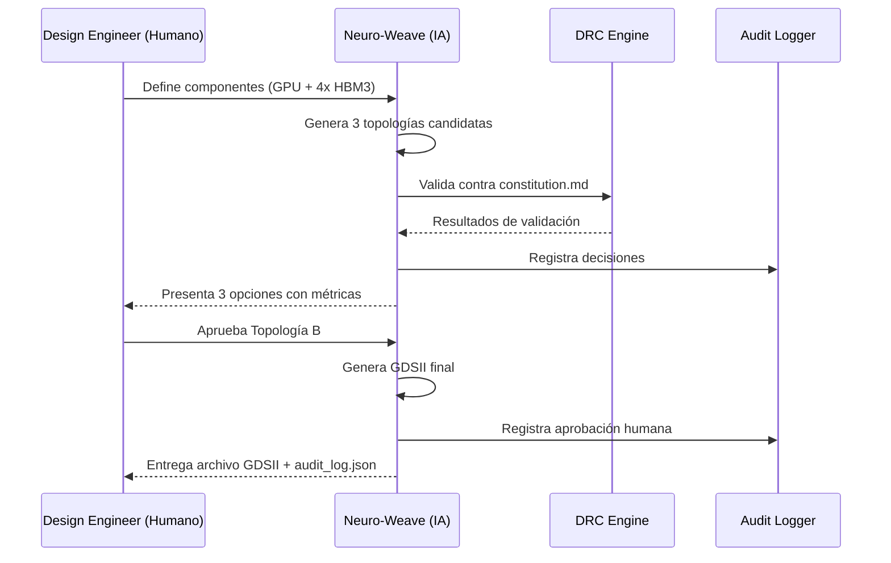

# Specification: Neuro-Weave v1.0
## Interposer Design Automation CLI

> **Nivel de Madurez:** Spec Draft  
> **Última Actualización:** 2026-02-09  
> **Propietario:** CTO (Accountable) | AI-Opt (Responsible)

---

## 1. Resumen Ejecutivo

**Neuro-Weave** es una herramienta CLI de diseño generativo para interposers de silicio 2.5D, especializada en configuraciones HBM3 + GPU/TPU. Utiliza algoritmos de optimización impulsados por IA para ruteo de TSV (Through-Silicon Vias) con validación DRC en tiempo real.

---

## 2. Goals (Objetivos)

| ID | Objetivo | Métrica de Éxito | Prioridad |
|----|----------|------------------|-----------|
| G-01 | Automatizar ruteo TSV para stacks HBM3 | ≥ 95% conexiones válidas en primer intento | P0 |
| G-02 | DRC en tiempo real contra constitution.md | Detección de violación < 100ms | P0 |
| G-03 | Generar archivos GDSII estándar | Compatibilidad 100% con TSMC/Samsung foundries | P0 |
| G-04 | Proponer topologías optimizadas térmicamente | ≥ 3 alternativas por diseño | P1 |
| G-05 | Audit trail completo ISO 42001 | 100% decisiones registradas | P0 |

---

## 3. Constraints (Restricciones Constitucionales)

> **Fuente:** [constitution.md](file:///D:/Microchips/governance/constitution.md)

### 3.1 Restricciones Físicas Inmutables

```yaml
thermal_limit_tj: 105  # °C máximo
tsv_density_max: 10000  # TSVs por mm²
micro_bump_pitch_min: 40  # μm mínimo
hbm_stack_max: 12  # dies máximo
```

### 3.2 Restricciones de Gobernanza

| Restricción | Implementación |
|-------------|----------------|
| Zero Hallucination | Validación contra physics_rules.yaml antes de output |
| Audit Trail | Log inmutable en formato JSON (ISO 42001 A.6.2.8) |
| Human Approval | Tape-out requiere firma digital de DesEng (Accountable) |

---

## 4. User Journey



---

## 5. Stack Tecnológico

| Capa | Tecnología | Justificación |
|------|------------|---------------|
| CLI Interface | Python (Click/Typer) | Ecosistema IA, integración con flujos existentes |
| Core Routing Engine | Rust | Seguridad de memoria, rendimiento para grafos grandes |
| Optimization | Python (SciPy, OR-Tools) | Algoritmos optimización combinatoria |
| GDSII Export | gdstk (Python) | Librería estándar open-source |
| Audit Logging | Structured JSON + SQLite | Trazabilidad inmutable |

---

## 6. Interfaces

### 6.1 CLI Commands

```bash
# Inicializar proyecto de diseño
neuro-weave init --project "HBM4-GPU-Stack"

# Definir componentes
neuro-weave add-component --type gpu --die-size 800mm²
neuro-weave add-component --type hbm3 --count 4

# Generar topologías
neuro-weave generate --optimize thermal,latency --count 3

# Aprobar diseño (requiere firma humana)
neuro-weave approve --topology 2 --engineer "jsmith" --signature <token>

# Exportar GDSII
neuro-weave export --format gdsii --output ./output/design_v1.gds
```

### 6.2 Input Files

```yaml
# design_input.yaml
project:
  name: "HBM4-GPU-Stack-v1"
  target_foundry: "TSMC"
  process_node: "CoWoS-S"

components:
  - type: gpu
    die_size_mm2: 800
    power_tdp_w: 700
  - type: hbm3
    count: 4
    capacity_gb: 24
    bandwidth_gbps: 1200

constraints:
  inherit_from: "constitution.md"
  custom:
    max_latency_ns: 5
```

### 6.3 Output Files

| Archivo | Formato | Descripción |
|---------|---------|-------------|
| `design.gds` | GDSII | Layout para foundry |
| `audit_log.json` | JSON | Trail de decisiones ISO 42001 |
| `thermal_report.html` | HTML | Mapa térmico interactivo |
| `drc_report.json` | JSON | Resultados de validación |

---

## 7. Quality Gates (ATDI)

Antes de cada commit/release, el código debe pasar:

| Gate | Umbral | Acción si Falla |
|------|--------|-----------------|
| Unit Test Coverage | ≥ 80% | Bloqueo de merge |
| ATDI Score | < 0.3 | Revisión arquitectónica obligatoria |
| DRC Validation | 100% pass | Bloqueo de export |
| Security Scan | 0 critical | Bloqueo de release |

---

## 8. Riesgos y Mitigaciones

| Riesgo | Probabilidad | Impacto | Mitigación |
|--------|--------------|---------|------------|
| Diseño viola reglas físicas | Media | Crítico | DRC en tiempo real |
| Pérdida de audit trail | Baja | Alto | SQLite + backup remoto |
| IA genera topología subóptima | Alta | Medio | Siempre 3+ opciones, humano decide |
| Incompatibilidad GDSII | Baja | Alto | Test con foundry samples |

---

## 9. Roadmap de Desarrollo

| Milestone | Entregable | Fecha Objetivo |
|-----------|------------|----------------|
| M1: Core CLI | init, add-component | T1 2026 |
| M2: Routing Engine | generate básico | T2 2026 |
| M3: DRC Integration | Validación en tiempo real | T2 2026 |
| M4: GDSII Export | export funcional | T3 2026 |
| M5: Audit System | Logging ISO 42001 | T3 2026 |
| M6: Beta Release | v0.9 para pruebas | T4 2026 |

---

*Documento generado bajo protocolo SDD (Spec-Driven Development)*
