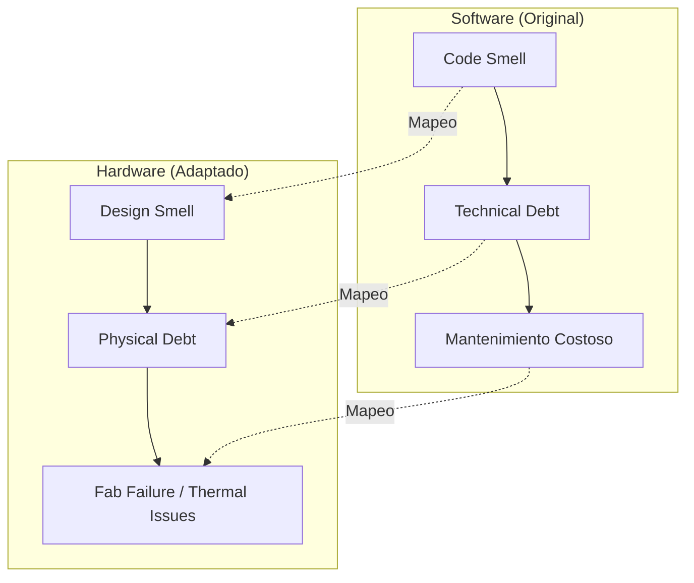

# ATDI Definitions for Silicon Design
## Architectural Technical Debt Index - Hardware Adaptation

> **Propósito:** Mapear los "Architectural Smells" del software a riesgos físicos en el diseño de semiconductores.

---

## 1. Visión General del ATDx para Hardware



---

## 2. Mapeo de Architectural Smells → Hardware Risks

| Smell (Software) | Equivalente Hardware | Riesgo Físico | Severidad | Acción |
|------------------|---------------------|---------------|-----------|--------|
| **Cyclic Dependency (CD)** | Signal Loop / Thermal Cycle | Race conditions, retroalimentación térmica | 🔴 CRÍTICO | **BLOQUEO** |
| **Hub-Like Dependency (HL)** | Routing Hotspot | Congestión, exceso densidad corriente | 🟠 ALTO | **ALERTA** |
| **God Component (GC)** | Monolithic Block | Imposible de enfriar/testear | 🟠 ALTO | **REVISIÓN** |
| **Unstable Dependency (UD)** | Volatile Signal Path | Timing violations | 🟡 MEDIO | **MONITOREO** |
| **Feature Concentration (FC)** | Function Overload | Punto único de falla | 🟡 MEDIO | **MONITOREO** |
| **Dense Structure (DS)** | Via Congestion | Límite físico de fabricación | 🔴 CRÍTICO | **BLOQUEO** |
| **Scattered Functionality (SF)** | Dispersed Routing | Latencia excesiva, consumo energético | 🟡 MEDIO | **OPTIMIZAR** |

---

## 3. Definiciones Detalladas

### 3.1 Cyclic Dependency (CD) → Signal Loop

**En Software:**
```
Module A → imports → Module B → imports → Module A
```

**En Hardware:**
```
Signal_A → feeds → Block_B → feeds → Block_C → feeds → Signal_A
```

**Riesgo Físico:**
- Condiciones de carrera en señales digitales
- Bucles de retroalimentación térmica (A calienta B, B calienta A)
- Imposibilidad de simulación estable

**Detección:**
```yaml
detector: cycle_detector
input: signal_graph.json
threshold: 0  # Cero ciclos permitidos
action: BLOCK_DESIGN
```

**Regla Constitucional:**
> [!CAUTION]
> **PHY-CD-001:** Ningún diseño con ciclos de dependencia no resueltos puede pasar a tape-out.

---

### 3.2 Hub-Like Dependency (HL) → Routing Hotspot

**En Software:**
```
10+ módulos dependen de una sola librería central
```

**En Hardware:**
```
10+ señales convergen en un único punto del interposer
```

**Riesgo Físico:**
- Densidad de corriente > límite del metal (electromigración)
- Punto caliente térmico (hotspot > 105°C)
- Cuello de botella de ancho de banda

**Detección:**
```yaml
detector: hub_analyzer
input: routing_topology.json
threshold:
  max_connections_per_node: 8
  max_current_density_mA_um2: 2.5
action: ALERT_THERMAL_RISK
```

**Regla Constitucional:**
> [!WARNING]
> **PHY-HL-001:** Ningún nodo puede tener más de 8 conexiones directas sin revisión térmica.

---

### 3.3 God Component (GC) → Monolithic Block

**En Software:**
```
Clase con 5000+ líneas, 50+ métodos, hace "de todo"
```

**En Hardware:**
```
Bloque de silicio que integra: controlador HBM + PHY + térmica + power management
```

**Riesgo Físico:**
- Imposible de descomponer para testing
- Zona de calor no manejable
- Acoplamiento masivo que propaga errores

**Detección:**
```yaml
detector: component_complexity
input: block_hierarchy.json
threshold:
  max_functions_per_block: 5
  max_io_pins: 500
  max_area_mm2: 50
action: REQUIRE_DECOMPOSITION
```

---

### 3.4 Dense Structure (DS) → Via Congestion

**En Software:**
```
Demasiadas dependencias en un paquete pequeño
```

**En Hardware:**
```
Densidad de TSV > 10,000/mm² (límite físico de fabricación)
```

**Riesgo Físico:**
- Fallo estructural del silicio
- Cortos entre vías
- Rechazo por foundry

**Detección:**
```yaml
detector: via_density_checker
input: tsv_map.gds
threshold:
  max_tsv_per_mm2: 10000  # Límite constitution.md
  min_pitch_um: 40
action: BLOCK_DESIGN
```

---

## 4. Cálculo del ATDI Score

### Fórmula

```
ATDI = Σ(smell_weight × smell_count) / total_components
```

### Pesos por Smell

| Smell | Peso | Justificación |
|-------|------|---------------|
| CD (Cycle) | 1.0 | Fatal - bloquea siempre |
| DS (Dense) | 0.8 | Límite físico violado |
| HL (Hub) | 0.5 | Alto riesgo térmico |
| GC (God) | 0.4 | Complejidad excesiva |
| UD (Unstable) | 0.3 | Riesgo de timing |
| FC (Feature) | 0.2 | Punto de falla |
| SF (Scattered) | 0.1 | Rendimiento subóptimo |

### Quality Gates

| ATDI Score | Estado | Acción |
|------------|--------|--------|
| 0.0 - 0.1 | ✅ Excelente | Aprobar |
| 0.1 - 0.2 | ✅ Bueno | Aprobar con notas |
| 0.2 - 0.3 | 🟡 Aceptable | Revisar antes de aprobar |
| 0.3 - 0.5 | 🟠 Riesgoso | Refactorización requerida |
| > 0.5 | 🔴 Crítico | **BLOQUEO AUTOMÁTICO** |

---

## 5. Integración con Neuro-Weave

### Comando de Análisis

```bash
neuro-weave analyze --atdi ./design/interposer_v1.json
```

### Output Ejemplo

```json
{
  "atdi_score": 0.23,
  "status": "ACCEPTABLE",
  "smells_detected": [
    {
      "type": "HUB_LIKE",
      "location": "HBM_CONTROLLER_NORTH",
      "connections": 12,
      "threshold": 8,
      "recommendation": "Split into 2 sub-controllers"
    }
  ],
  "blocking_issues": 0,
  "timestamp": "2026-02-09T12:25:00Z",
  "constitution_check": "PASS"
}
```

---

## 6. Evidencia ISO 42001 (Clause 9)

Este sistema de ATDI satisface los requisitos de **Evaluación del Desempeño**:

| Requisito ISO | Implementación ATDI |
|---------------|---------------------|
| 9.1 Monitoreo | Análisis automático en cada commit |
| 9.2 Auditoría | Logs JSON inmutables |
| 9.3 Revisión | Dashboard con tendencias ATDI |

---

*Documento ATDx v1.0 | Silicon Synthesis Corp*
